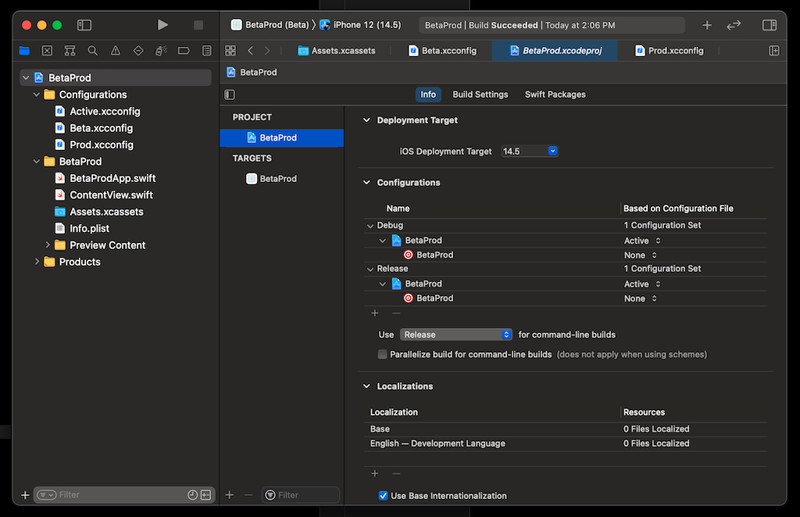
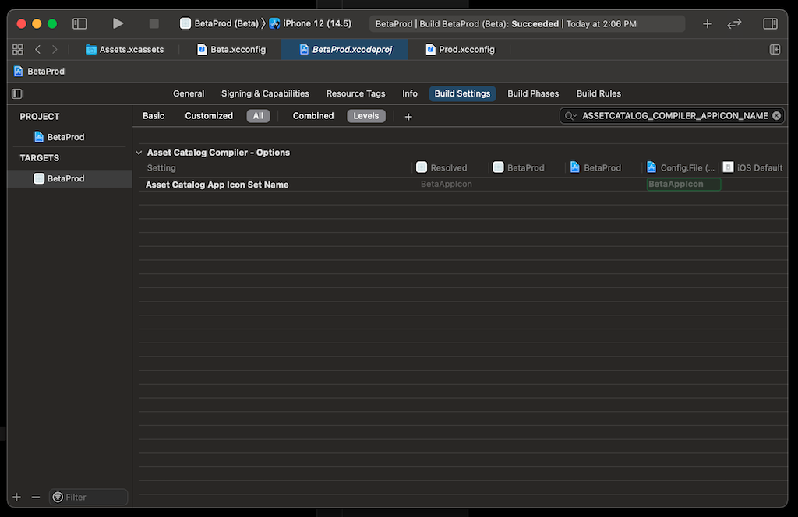

# BetaProd Build Variants

You are building an app and set up a Beta environment you use during development and a Prod environment for releases. Switching between them could require many manual changes which could be automated with CI/CD. Or you could handle it all as a part of your normal build using Xcode Build Schemes.

In this demo there are 2 Build Schemes. One for Beta and another for Prod. The pre-action script defined for these build schemes run `set-environment.sh` in the `scripts` folder to update `Active.xcconfig` to import either `Beta.xcconfig` or `Prod.xcconfig` before the build starts. These Xcode config files include any build settings which are unique to Beta and Prod builds.

## App Icon

One use for it is to change images asssets for the App Icon. You can use [Bakery] to create icons for each variant so you can see which app you can run. There are 2 icon sets define in the `AppIcon` folder. The script which changes the Xcode config files also copies these files in place for the App Icon. More variants could be created and placed in the `AppIcon` folder.

Note: Once the default icon set is added to source control the files can be ignored so that when files are change with the build they won't show up as changes. use `scripts/ignore-icon-changes.sh` to ignore changes for these files.



The build settings should inherit these values from the Xcode config files and any local overrides in the build target should be cleared out.



Any build settings which are defined in the Xcode configuration files may be overridden by the build target. Make sure to clear them out by selecting that row in Build Settings and tapping delete. Select All and Levels to see which values are set and at which level.

## Cloud Configuration

You may have multiple environments for your cloud resources that are placed in a JSON file and included in the build as a resource. That resource is included in the main bundle when the app is built. The script which copies the active Xcode build configuration in place also copies a JSON file in place as well. By copying the active cloud configuration in place for the build it will not leave the Beta configuration in the main bundle when it is built for Prod which would otherwise reveal endpoints you would prefer to keep private.

CAUTION: For a real build, these cloud configuration files should not be placed in source control. Developers can copy them in place and have them left out of source control updates while CI/CD systems fetch these files prior to running the build.

## Conditional Builds

A build flag can be defined in .xcconfig files which can cause code to be included or excluded from a build. It is also possible to use that value in a shell script run as a Build Phase Script.

Simply add a custom value to the .xcconfig file.

```sh
// Used with #ifdef in Swift code
BUILD_WIDGETS = YES
```

Then a shell script run as a Build Phase Script can use it.

```sh
#!/bin/sh

if [ ! -z "$BUILD_WIDGETS" ]; then
    echo "Building widgets"
else
    echo "Skipping build for widgets"
fi
```

It can also be used to include or exclude code from a build. A value like `widgetsIncluded` could be set to a boolean value which will be defined for either version of the build.

```swift
import Foundation

#if BUILD_WIDGETS

let widgetsIncluded = true

struct WatchWidget {}

struct TodayWidget {}

#else

let widgetsIncluded = false

#endif
```

These checks can be used for many different use cases, such as defining entirely different values for different settings. There could be as many Build Schemes matched to .xcconfig files as needed to support every variation.

## Reading Values at Runtime

Values which are defined in .xcconfig files can also be accessed at runtime by including them in the `Info.plist` which is built into every app and included in the main bundle. One great use case is to define hostnames for different environments. For a Beta the app would use a different hostname than Prod yet would have the same semantics for that API. Keeping the hostnames out of the code prevents it from being included in a build, so a Prod app never includes any details about the Beta environment.

Look at the sample project to see how `Info.plist` includes a value for `AppAPIHostname` which is set to `$(APP_API_HOSTNAME)` which is a value defined in the .xcconfig files. This required value is then made available with a computed property.

```swift
var apiURL: String {
    guard let dictionary = Bundle.main.infoDictionary,
          let hostname = dictionary["AppAPIHostname"] as? String else {
        fatalError("Required value for API URL is not defined.")
    }
    return "https://\(hostname)"
}
```

## Additional Changes

Any build setting can be placed in the Xcode config files. There are the build settings which Apple has defined for use Xcode and custom values are allowed as well which can be accessed during the build. Setting different values for C and Swift flags is also a good use for Xcode config files.

* [Xcode Build Configuration Files]

## Building in Terminal

With the 2 build schemes defined either can be selected in Xcode during development or built from the Terminal with the commands below. Both run `xcodebuild` which is a part of Xcode to buid the selected build scheme.

*Build for Beta*
```sh
xcodebuild -project BetaProd.xcodeproj -scheme "BetaProd (Beta)" build
```

*Build for Prod*
```sh
xcodebuild -project BetaProd.xcodeproj -scheme "BetaProd (Prod)" build
```

## Build Schemes

The call to `set-environment.sh` is done in a pre-action script with the build schemes. Edit a build scheme and expand the Build section to see the pre-actions. It will need the build settings from the project so that `PROJECT_DIR` is defined to run the script. More build schemes can be created along with more Xcode config files to support them.

## Active Xcode Config

Initially `Active.xcconfig` can be added to source control with a note that it should not be modified and once it is added to source control it can be added to `.gitignore` so that changes made to it during the build are ignored.

---
[Bakery]: https://apps.apple.com/us/app/bakery-simple-icon-creator/id1575220747?mt=12
[Xcode Build Configuration Files]: https://nshipster.com/xcconfig/
